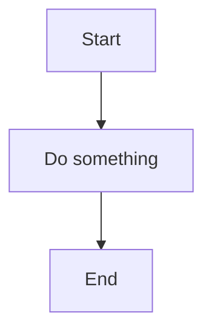

# Spool


```mermaid
graph TD
  A[Start] --> B[Do something]
  B --> C[End]
```

The CLI has four different commands:

- `lint`
- `lsp`
- `site`
- `weave`

```ts
// ::SPOOL:: <<src/cli.ts:no-expand-nested>>
```
